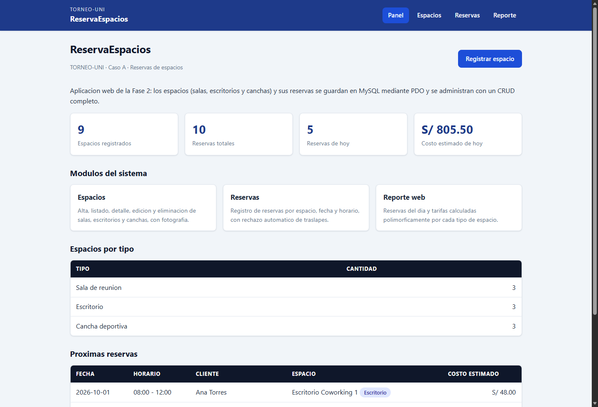
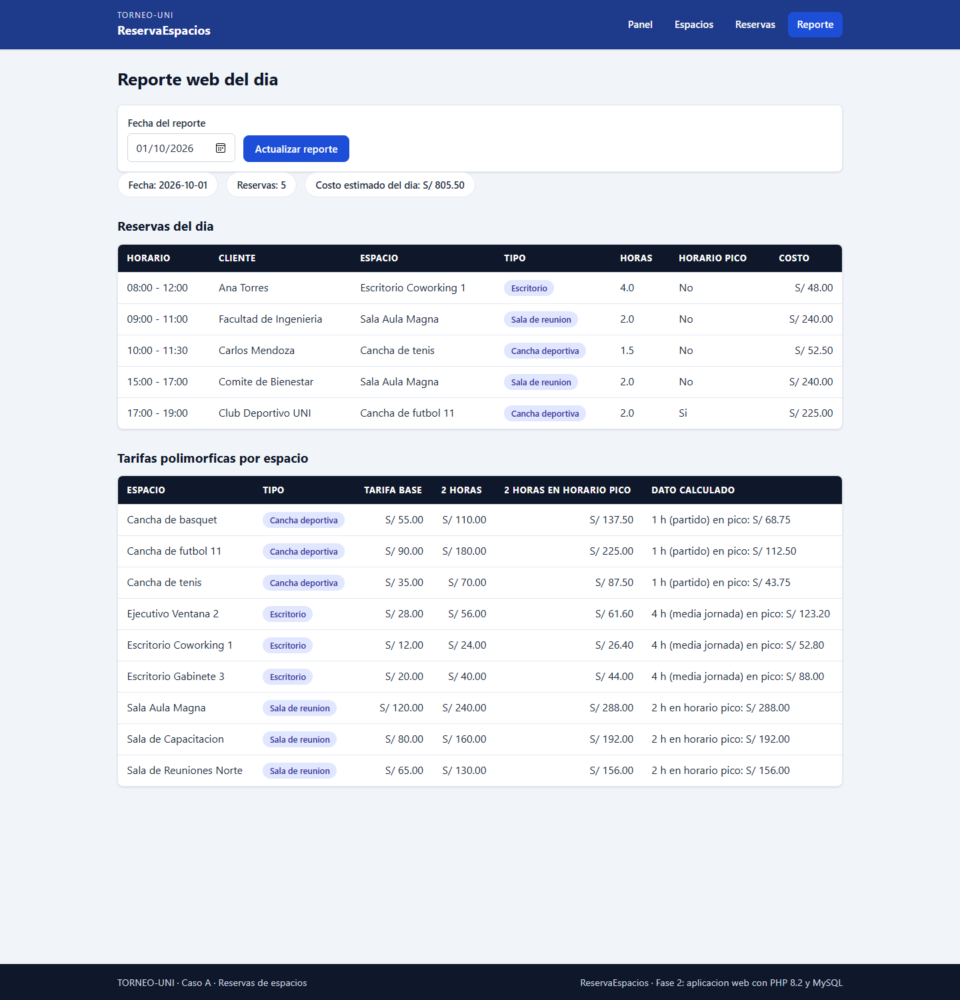
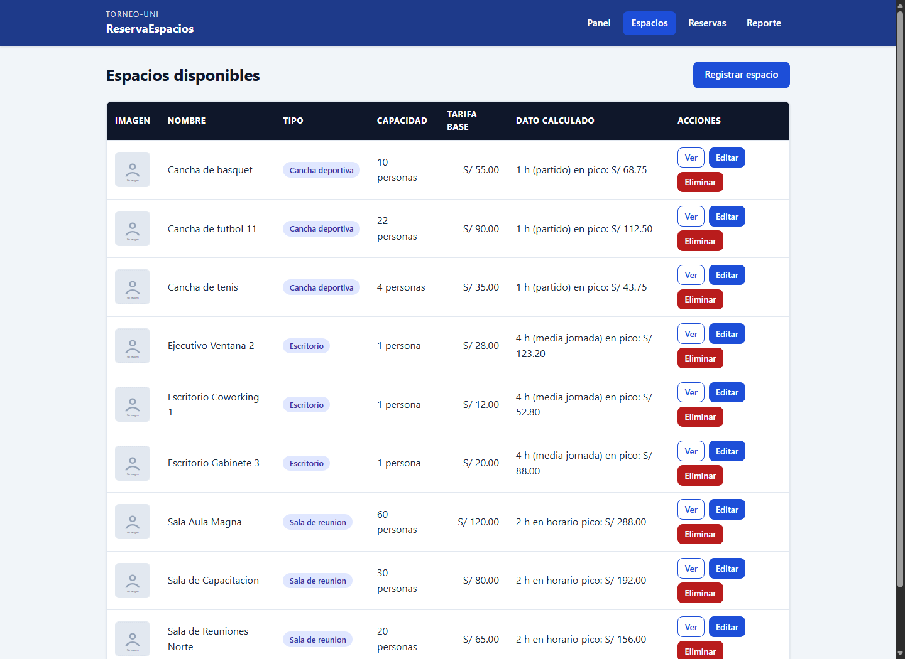
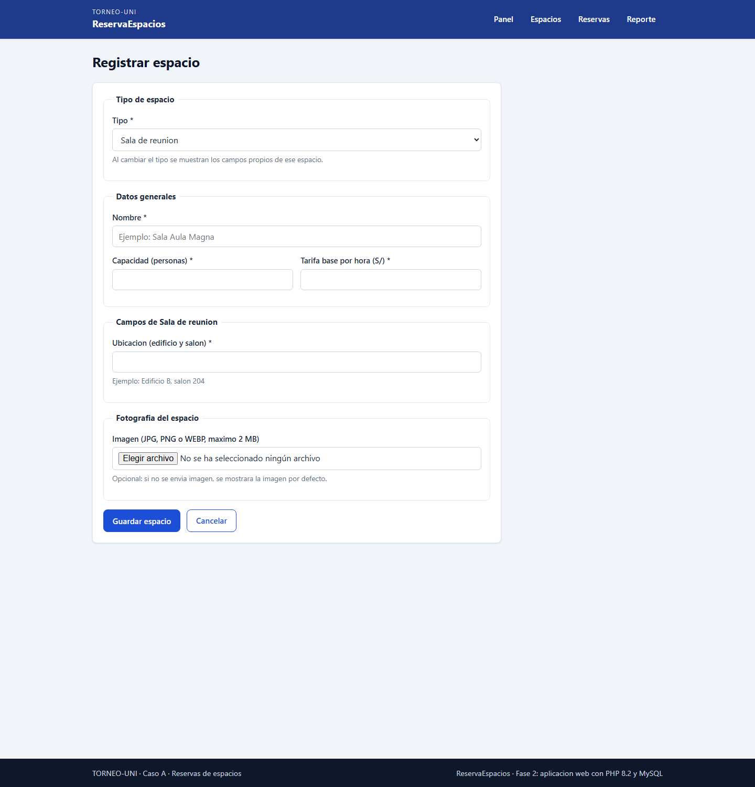
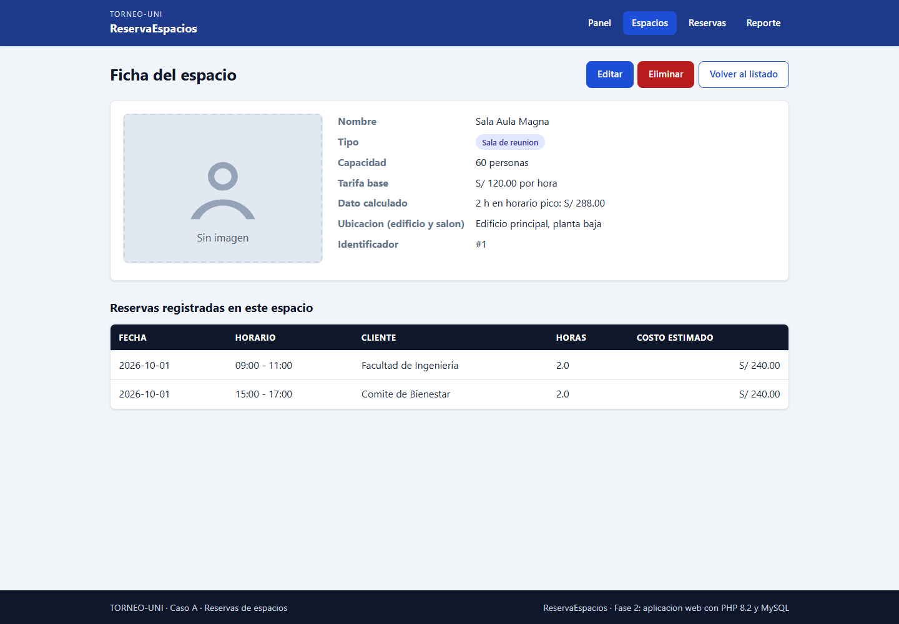
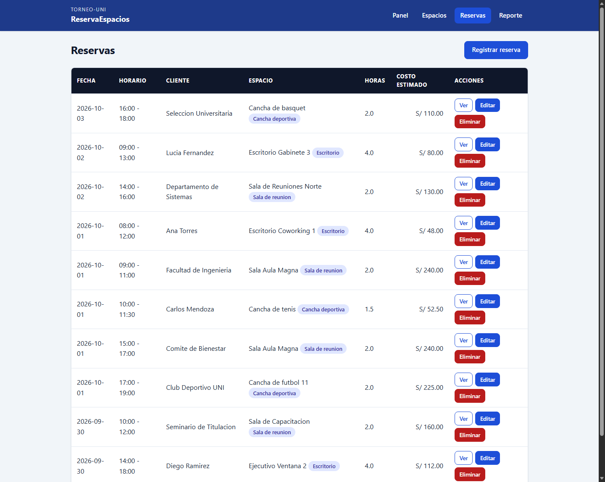

# TORNEO-UNI: Reserva de espacios (Fase 2 · Caso A)

Aplicacion web en PHP para administrar los espacios del complejo (salas de
reunion, escritorios de trabajo y canchas deportivas) y las reservas que se
hacen sobre ellos, con un CRUD completo, imagenes propias, validacion en el
servidor y cliente, y un reporte web que calcula las tarifas de forma
polimorfica.

| Panel inicial | Reporte web del dia |
| --- | --- |
|  |  |

| Listado de espacios | Formulario de registro |
| --- | --- |
|  |  |

| Ficha del espacio | Listado de reservas |
| --- | --- |
|  |  |

## Requisitos

- PHP 8.1 o superior (probado con PHP 8.2.12 de XAMPP)
- Composer 2
- MySQL o MariaDB (probado con MariaDB 10.4.32 de XAMPP / MySQL 9.3)
- Un servidor web local: el embebido de PHP basta

## Instalacion y ejecucion

### 1. Dependencias (PSR-4)

```bash
composer install
```

Si ya existia el directorio `vendor/`, basta con:

```bash
composer dump-autoload -o
```

### 2. Base de datos

Crea la base `reserva_espacios` con sus datos de prueba. Cualquiera de las
dos opciones es valida:

**Opcion A - PHPMyAdmin (recomendada):**

1. Abre `http://localhost/phpmyadmin`.
2. Pestaña **Importar**: selecciona `database/schema.sql` y ejecutar.
3. Repite el paso con `database/seed.sql`.

**Opcion B - linea de comandos:**

```bash
mysql -u root -p < database/schema.sql
mysql -u root -p < database/seed.sql
```

`schema.sql` crea la base, las tablas `espacios` (tabla unica con la columna
`tipo` y constraints `CHECK`) y `reservas` (con clave foranea
`ON DELETE RESTRICT`). `seed.sql` inserta 5 espacios por tipo (15 en total) y
10 reservas, varias con la fecha actual para que el panel y el reporte
muestren datos. **Atencion:** `seed.sql` borra y vuelve a cargar todos los
datos de prueba (`TRUNCATE`), asi que no lo ejecutes si quieres conservar
registros propios.

### 3. Configuracion

Copia el ejemplo y ajusta tus credenciales (host, puerto, usuario y clave):

```bash
copy config\config.example.php config\config.php    # Windows
# cp config/config.example.php config/config.php    # Linux/macOS
```

`config/config.php` esta en `.gitignore`: no se sube al repositorio.

### 4. Servidor local

Desde la raiz del proyecto:

```bash
php -S 127.0.0.1:8085 -t public
```

Abre <http://127.0.0.1:8085/index.php>. Si usas XAMPP/Apache, en su lugar
puedes apuntar el VirtualHost a la carpeta `public/` (todo lo accesible por
HTTP vive ahi; `src/`, `views/`, `config/` y `database/` quedan fuera).

> El directorio `public/uploads/` debe ser escribible: ahi se guardan las
> imagenes con un nombre aleatorio generado por el sistema. Si no lo es, mira
> [Problemas frecuentes](#problemas-frecuentes).

## Problemas frecuentes

### 1. Puerto ocupado: `Address already in use` o pagina en blanco

El servidor embebido no arranca porque el puerto ya esta tomado (otra instancia
de `php -S`, Apache de XAMPP, otro proyecto). Identifica el proceso y, si no lo
necesitas, terminarlo; si no, levanta la aplicacion en otro puerto:

```powershell
# Windows: quien escucha el 8085
netstat -ano | findstr :8085
Get-Process -Id <PID>            # a que proceso pertenece
Stop-Process -Id <PID>           # solo si puedes terminarlo
```

```bash
# Linux/macOS
lsof -i :8085
kill <PID>
```

O en cualquier sistema, con otro puerto (recuerda usar esa URL en el navegador):

```bash
php -S 127.0.0.1:8086 -t public
```

Con XAMPP/Apache el conflicto no es el 8085 sino el 80: desactiva Apache desde
el panel de XAMPP si vas a usar el servidor embebido, o usa solo Apache.

### 2. No se guardan las fotos: `public/uploads/` sin permisos de escritura

**Sintoma:** al registrar un espacio con imagen aparece junto al campo
«No se pudo guardar la imagen en el servidor.» (el detalle queda en el log de
PHP). La carpeta se crea sola si no existe, pero debe ser escribible por el
usuario que atiende las peticiones (el de la CLI con `php -S`, o `www-data`
cuando sirve Apache):

```powershell
# Windows
icacls public\uploads /grant "%USERNAME%:(OI)(CI)M" /T
```

```bash
# Linux/macOS (Apache)
chmod -R 775 public/uploads
sudo chown -R www-data:www-data public/uploads
```

Comprobacion en una linea (debe imprimir `bool(true)`):

```bash
php -r "var_dump(is_writable('public/uploads'));"
```

### 3. La base de datos no existe o no coincide con la configuracion

**Sintoma:** la pagina responde «Ocurrio un error inesperado» (o el texto
«Falta la configuracion: copia config/config.example.php como
config/config.php y ejecuta database/schema.sql y database/seed.sql»). Casi
siempre es una de estas tres causas:

1. Falta `config/config.php`: copia el ejemplo.

   ```bash
   copy config\config.example.php config\config.php    # Windows
   # cp config/config.example.php config/config.php    # Linux/macOS
   ```

2. La base nunca se creo (o quedo sin datos). Crea la base y carga el seed:

   ```bash
   mysql -u root -p < database/schema.sql
   mysql -u root -p < database/seed.sql
   ```

3. Las credenciales de `config/config.php` (`host`, `puerto`, `nombre`,
   `usuario`, `clave`) no coinciden con tu servidor. Ajustalas y vuelve a
   probar; `nombre` debe ser `reserva_espacios`.

Para ver el motivo exacto, busca el mensaje que registro la aplicacion
(`[ReservaEspacios] PDOException: ...`): con `php -S` aparece en la misma
consola donde arrancaste el servidor; en XAMPP, en `php_error.log`.

## Pruebas

```bash
php main.php          # demo de escritorio de la Fase 1 (JSON + polimorfismo)
php tests/smoke.php   # se espera SMOKE_TEST_OK
```

Pruebas web end-to-end (requieren el servidor en el puerto 8085 y la base
cargada con el seed; se ejecutan desde la raiz y terminan con `FALLOS=0`):

```bash
powershell -ExecutionPolicy Bypass -File tests/e2e/web-espacios.ps1
powershell -ExecutionPolicy Bypass -File tests/e2e/web-reservas-imagenes.ps1
```

Cubren mas de 100 comprobaciones: paginas HTTP 200 sin errores de PHP,
HTML5 semantico, token CSRF (ademas de un POST con token invalido), PRG,
errores de validacion por campo, alta/edicion/baja de espacios con imagen
(subida valida, MIME falso, archivo de mas de 2 MB, reemplazo y borrado del
archivo viejo), eliminacion protegida por reservas asociadas, rechazo de
reservas traslapadas y de horarios invertidos, reporte por fecha y escape de
`htmlspecialchars` con nombres que contienen etiquetas HTML.

## Estructura

```
config/          config.example.php (se sube) y config.php local (no se sube)
database/        schema.sql y seed.sql
docs/capturas/   capturas de pantalla usadas en README e informe
public/          unico punto de entrada HTTP: paginas, css, js, uploads/
src/             Codigo fuente (PSR-4 App\): bootstrap, modelos, fabricas,
                 repositorios, validacion, servicios y helpers
tests/           smoke.php (CLI) y e2e/ (pruebas web)
views/           Plantillas HTML (layout, parciales y vistas de cada modulo)
```

## Seguridad y buenas practicas aplicadas

- Todas las consultas usan PDO con consultas preparadas (sin concatenar datos
  del usuario).
- Tokens CSRF en cada formulario POST, verificados en el servidor.
- Patron PRG (Post/Redirect/Get) con mensajes flash en todas las acciones.
- Validacion en el servidor (clase `Validador`) y mejora progresiva en el
  cliente (`public/js/formulario.js`); las vistas escapan con `e()`.
- Imagenes: tamano maximo 2 MB, tipo MIME real por `finfo`, nombre aleatorio
  generado por el sistema, y imagen por defecto (`public/img/sin-imagen.svg`)
  cuando no hay fotografia.
- El polimorfismo se concentra en `EspacioFactory`: las vistas no usan
  `instanceof`, `get_class()` ni condicionales por tipo concreto.

## Evidencia para la exposicion (etiquetas `[CONCEPTO]`)

- **[ABSTRACCION]** `Espacio` abstracta con `etiquetaTipo()` y `datoCalculado()`;
  contrato `Reservable`.
- **[ENCAPSULAMIENTO]** propiedades `private/protected/readonly` y getters.
- **[HERENCIA]** `Sala`, `Escritorio` y `Cancha` extienden `Espacio`.
- **[POLIMORFISMO]** `calcularCosto()` y `datoCalculado()` resuelven cada tipo
  sin condicionales en el llamador (listados, fichas y reporte).
- **[INTERFAZ]** `Reservable` y `Exportable` definen contratos.
- **[COMPOSICION]** `Reserva` conoce a `Espacio`; `ReservaRepositorio` recibe
  `EspacioRepositorio` y `GestorImagenes` por constructor.
- **[FABRICA]** `EspacioFactory` y `ReservaFactory` crean objetos desde la fila
  de la base o desde el formulario.
- **[INYECCION-DEPENDENCIAS]** repositorios y servicios reciben `PDO` y
  colaboradores por constructor.
- **[CRUD-CREATE/READ/UPDATE/DELETE]** `EspacioRepositorio` y
  `ReservaRepositorio`.
- **[SEGURIDAD]** CSRF, consultas preparadas, nombres aleatorios de imagen,
  escape de salida.
- **[VALIDACION]** `Validador` (servidor) + `public/js/formulario.js` (cliente).
- **[PRG]** todas las acciones POST redirigen con mensajes flash.

## Despliegue

Etiqueta final:

```bash
git fetch --tags
git checkout v2.0
composer install --no-dev
```

Copia de ejemplo en cada equipo: `config/config.example.php` → `config/config.php`.
